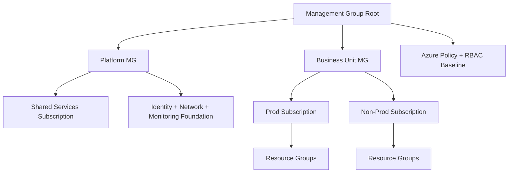
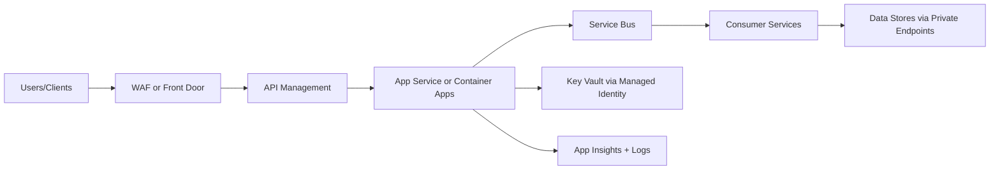
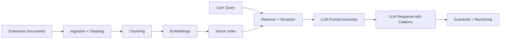

# Visual Learning Diagrams

Use these diagrams to understand flow end-to-end before memorizing details.

## 1) Azure Landing Zone and Governance

## 2) Secure API and Integration Architecture

## 3) Enterprise RAG Architecture

## Diagram Practice Questions

1. Explain each component and why it exists.
2. Identify top 3 failure points and mitigations.
3. Which parts are security-critical and why?
4. Which parts drive most operational cost?

